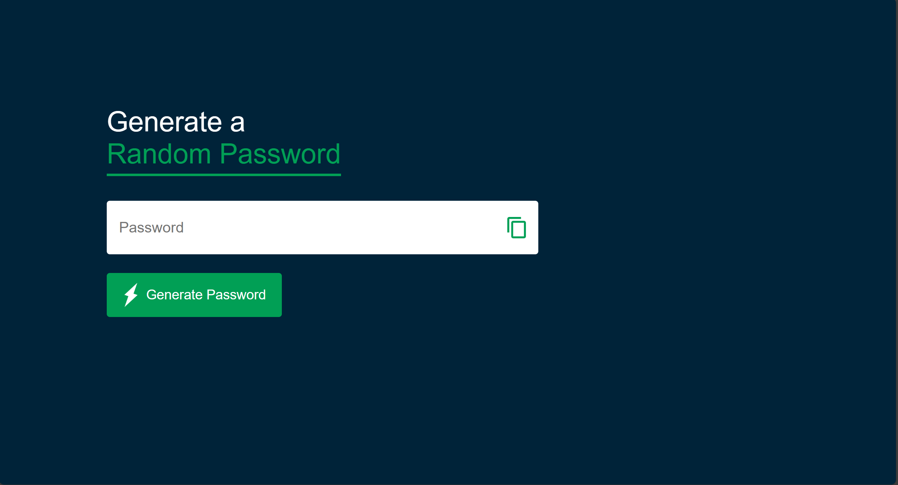
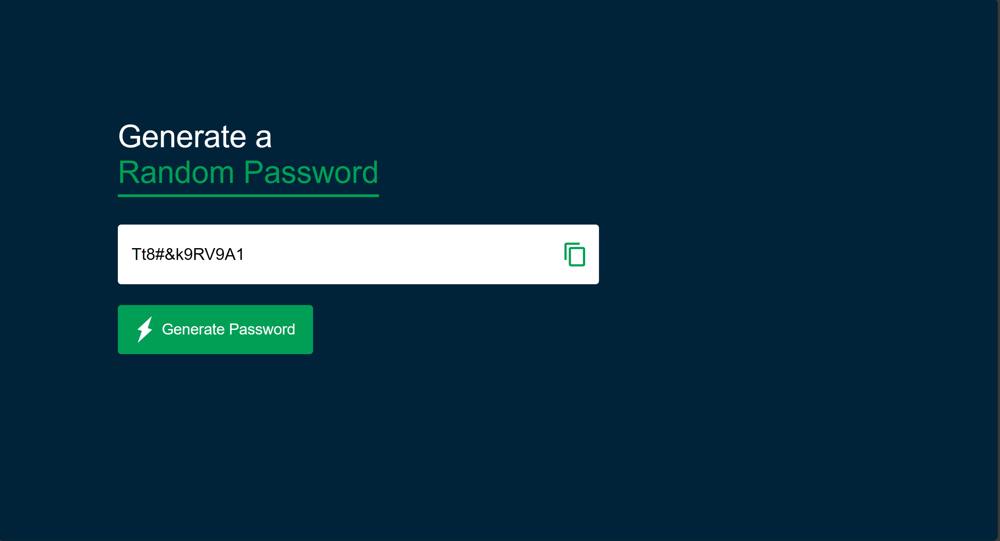

# 🔐 Random Password Generator

A simple and modern **Random Password Generator** built with HTML, CSS, and JavaScript.  
It generates strong passwords instantly and allows you to copy them with one click.

---

## 🚀 Features
- ⚡ Generate secure random passwords instantly.
- 📋 One-click **copy to clipboard**.
- 🎨 Clean and responsive UI.
- 🔒 Mix of uppercase, lowercase, numbers, and symbols.

---

## 🛠️ Tech Stack
- **HTML5**
- **CSS3**
- **JavaScript (Vanilla JS)**

---

## 📸 Preview

### Initial Screen


### With Generated Password


---

## ⚙️ Installation & Setup

1. Clone this repository:
   ```bash
   git clone https://github.com/AnasKhan322/Password-Generator.git
   cd Password-Generator
